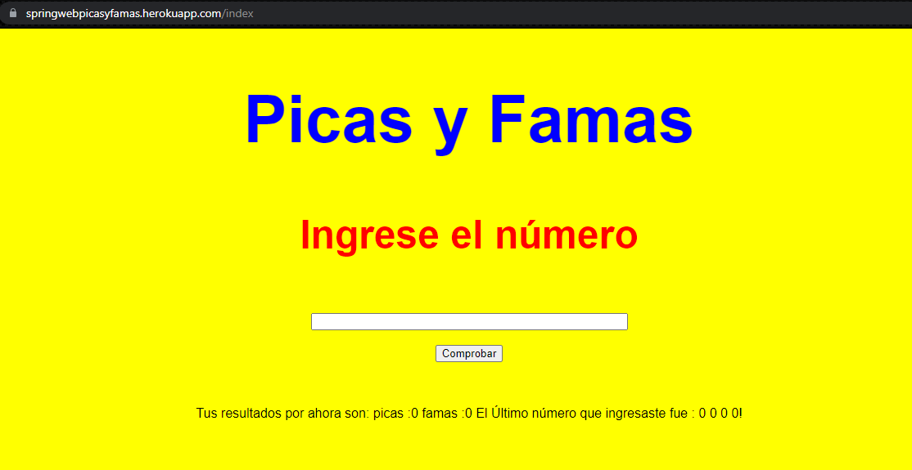
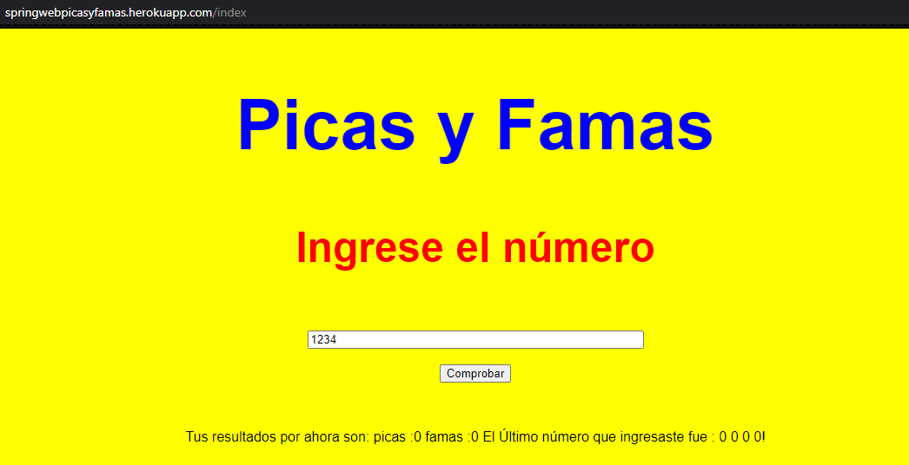
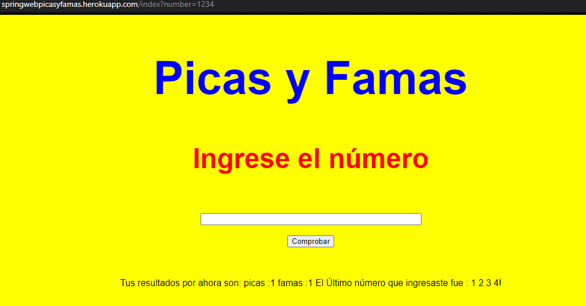
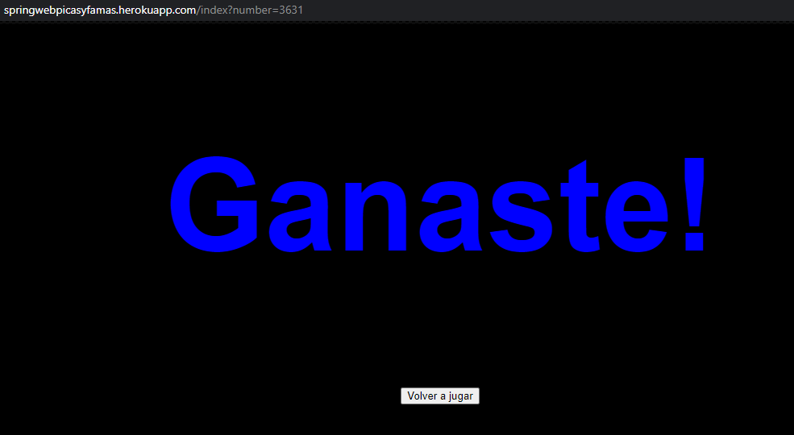
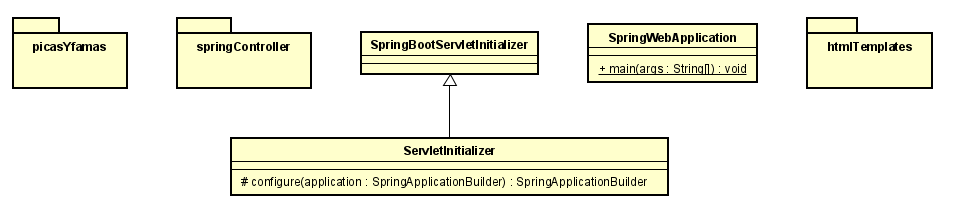
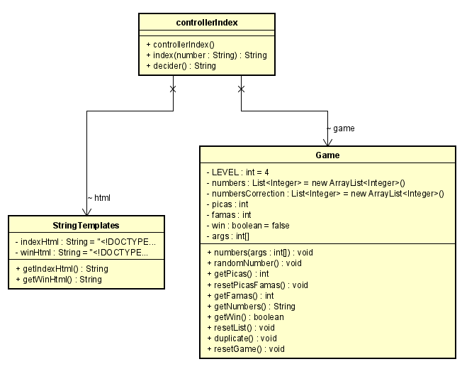
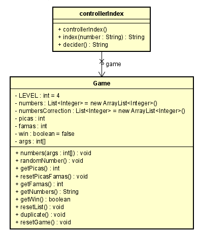
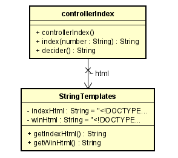
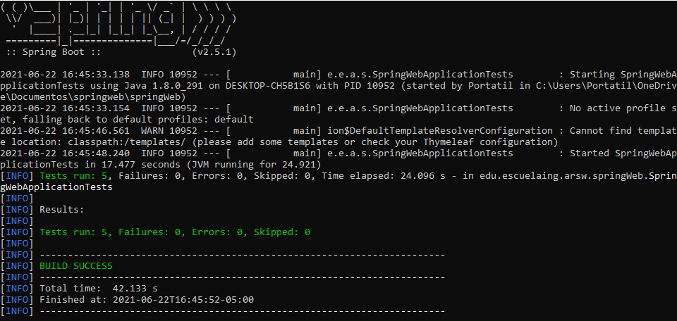

# SpringWeb

### Daniel Santiago Ducuara Ardila
### 21/06/2021

## Resumen
Este taller consiste en realizar el juego conocido como picas y famas, se generará un número aleatorio de 4 dígitos y el usuario debe adivinar dicho número.
Cada vez que el usuario escriba su número el programa le retornará el número de picas, famas y el útimo número ingresado.
picas: cantidad de números en la posición correcta.
famas: cantidad de digitos que se encuentran en el número pero en una posicion incorrecta.

## Instrucciones
Para la ejecución del programa localmente es necesario iniciar la clase SpringWebApplication y en el navegador colocar la siguiente ruta:
http://localhost:8080/index
Para la ejecución en heroku se debe hacer clic sobre la imágen de heroku y directamente el enlace lleva al juego.

Esta es la pantalla de inicio que se presenta al usuario.
 
El usuario ingresa un número de 4 dígitos y dar clic en comprobar.
 
El programa mostrará cuantas picas y famas se obtuvo, además del último número ingresado, el usuario debe seguir intentando hasta adivinar el número.
 
Una vez el jugador gana sale un mensaje de felicitaciones y el usuario puede volver a jugar dando click al botón.
 
## Diagrama de clases

### Paquete springWeb
 
Este paquete consta de las clases principales de spring boot llamadas SpringWebApplication y ServletInitializer que simplemente se encargan de la configuración
y arranque de spring boot. Dentro de este paquete tambien se encuentran los subpaquetes de picas y famas que es la clase que realiza el juego, springController 
que es el controlador de spring boot,y htmlTemplates que almacena el diseño html.

### Paquete Springcontroller
 
Este paquete consta de la clase controllerIndex, esta clase se encarga manejar spring boot y se encarga de hacer un llamado a la clase Game para iniciar el juego,
esta clase también recibe el número ingresado por el usuario y lo envía a Game para realizar el conteo de picas y famas, una vez tiene el resultado llama a la clase
StringTemplates para retornar una página html con el resultado obtenido al ejecutar el número ingresado por el usuario.

### Paquete picasyFamas
 
Este paquete consta de la clase Game, en esta clase se crea el juego de picas y famas, la clase cuenta con una lista de números aleatorios y variables como 
contadores de picas y famas,otras listas y una variable boolean que cambia si el usuario gana el juego. Cuenta con métodos para contar picas y famas, retornar
variables,actualizar variables y reiniciar el juego.La clase controllerIndex es quien hace un llamado al juego para iniciarlo.

### Paquete templates
 
Este paquete consta de la clase StringTemplates que solamente contiene dos atributos que contienen las páginas html y dos métodos que retornan esta variable una vez 
el controlador solicita dichas páginas.

## Reporte de pruebas
 
Se realiza prueba a la clase game verificando que retorne valores verdaderos de picas y famas, las pruebas constan de 2 pruebas a picas, 
2 pruebas a famas y una prueba para comprobar que el usuario gana el juego con 4 picas.
## Productividad
La productividad de este proyecto fue de 235LOC/26 horas .

